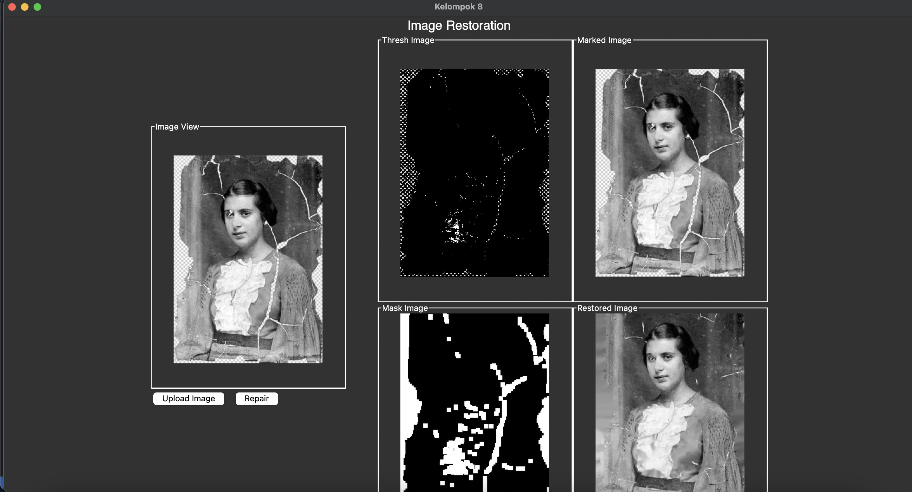

# Tkinter-Image-Restoration

Machine Vision with Open Cv Python



Penerapan perbaikan citra yang rusak dengan opencv python dan tkinter untuk GUI program.

How to use?

First clone repository
```
git clone https://github.com/dap23/Tkinter-Image-Restoration.git
```

Open repository on your terminal
```
cd Tkinter-Image-Restoration
```

Install dependencies
```
pip install -r requirement.txt
```

Run python file
```
python3 main.py
```
